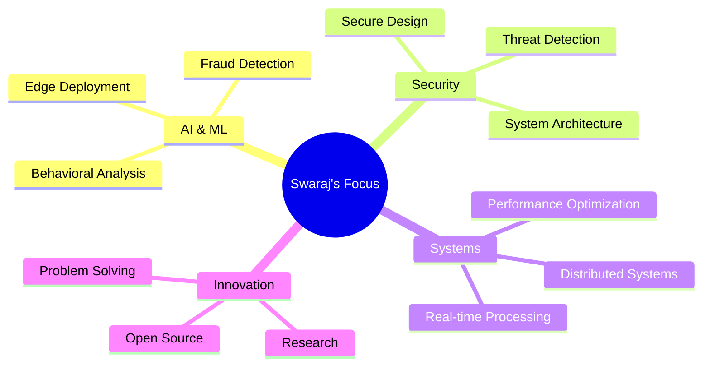

<div align="center">

<!-- Animated Header with Gradient -->


<!-- Animated Typing Effect with Custom Styling -->
<p align="center">
  
</p>

<!-- Badges with Animation -->
<p align="center">
  
  
  
</p>

<!-- Separator -->


</div>

##  About Me

```yaml
name: Swaraj Kumar
located_in: Bengaluru, Karnataka, India
education: Computer Science Undergraduate (2023-2027)

interests: ["Machine Learning", "Cybersecurity", "Distributed Systems", "AI Research"]

philosophy: "Building intelligent systems that make a difference"
```

<div align="center">

<!-- Activity Graph -->


</div>


##  Tech Arsenal

<div align="center">


### AI/ML & Data
<p>
  
</p>

<table>
<tr>
<td align="center">

### Languages


</td>

<td align="center">

### Web & Backend


</td>
</tr>

<tr>
<td align="center">

### DevOps & Cloud


</td>

<td align="center">

### Databases


</td>
</tr>
</table>

</div>


## 📊 GitHub Statistics

<div align="center">
  
  
</div>

<div align="center">
  
  
</div>


## 🎯 Current Mission

<div align="center">



</div>


## 📫 Let's Connect

<div align="center">

[](https://linkedin.com/in/swarajkumar1)
[](mailto:swarajkmrsahu@gmail.com)

</div>

<div align="center">

### 💭 Random Dev Quote


</div>

<!-- Animated Footer -->

